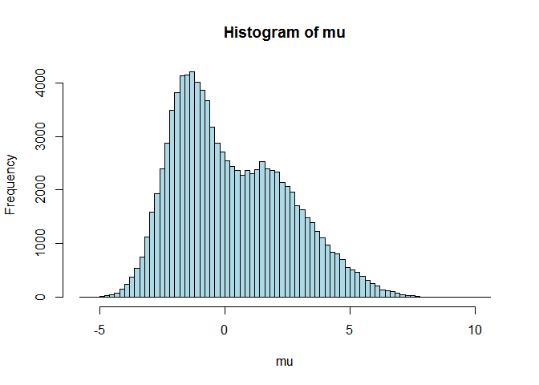

README
================

To install and use the package you can run in R:

``` r
library(devtools)
install_github('RRDecon','omadrid1')
library(RRDecon)
```

This an R package based on the methods from the paper "A deconvolution path for mixtures". The main functions are

``` r
 L2_deconvolution_path
 L2_deconvolution
 L2_deconvolution_path
 L1_deconvolution_path
```

To get help on the input parameters of this functions you can type "??" before the name of the function. Below we provide an example using these functions.

To construct an example you can first create mixtures of normals. This is given below as parameter lists.

``` r
parlist = list()
parlist[[1]] =  list(weights=c(0.5,0.4,.1), mu=c(-1.5,1.5,4), tau2 = c(1,2,2))
parlist[[2]] = list(weights=c(1/3,1/3,1/3), mu=c(0,-2,3), tau2 = c(2,.1,.4))
parlist[[3]] = list(weights=c(0.3,0.4,0.3), mu=-c(0,0,0), tau2 = c(0.1,1,9))
parlist[[4]] = list(weights=c(0.2,0.3,0.3,0.2), mu=c(-3,-1.5,1.5,3), tau2 = c(0.01,.01,.01,0.01))
parlist[[5]] =   list(weights=c(0.4,0.4), mu=c(-1.5,1.5), tau2 = c(1,1))
parlist[[6]] =  list(weights=c(0.5,0.4,0.1), mu=c(0,-2,3), tau2 = c(.2,.1,.4))
```

Next we choose a sample size, bin size, and a true mixing density.

``` r
## sample size
n = 100000  
##  bin size
d = 150
## index to the parameter lists defined before to induce a mixing density  
den = 2
## parameters of the mixture of normals mixing density
mypars = parlist[[den]]
true_mu = mypars$mu
true_weights =  mypars$weights
true_tau2 = mypars$tau2
```

We can generate data normal means from the mixing density chosen. We run:

``` r
mu = RRDecon::rnormix(n,true_weights,true_mu,true_tau2)
hist(mu,100,col= "lightblue")
```



Next we generate the observed data:

``` r
n = length(mu)
y = mu + rnorm(n)
hist(y,100,col= "lightblue")
```


We can obtain one estimated function using L2 regularization by runing

``` r
set.seed(100)
library(RRDecon)
library(glmgen)
library(genlasso)
## computing estimnate
system.time({temp = RRDecon::L2_deconvolution(y,prop = 0.25, d= 150)})
```

    ##    user  system elapsed 
    ##    7.02    0.00    7.05

``` r
##  locations at which mixing density is estimated
loc =  temp$loc
## estimated mixing density
f_hat = temp$f_hat
##   true mixing density
f_true =  dnormix(loc,true_weights,true_mu,true_tau2)
## MSE
mean((f_true -  f_hat)^2)
```

    ## [1] 0.0003060393

``` r
## Plot of the estimated mixing density
delta = loc[2] - loc[1]
mid_points = c(loc-delta/2,loc[length(loc)]+delta/2)
hist(mu,breaks =mid_points,col= "lightblue",prob=TRUE,tilte="Latent normal means and estimated mixing density")
lines(loc,f_hat, col='red', lwd=2)
```


